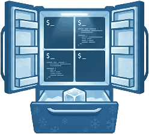

<div align="center">
  
  <h1>tmux-fridge</h1>
</div>

A lightweight CLI tool for snapshotting, freezing, and restoring tmux sessions — with automatic cold storage backups for disaster recovery. Written in Go with zero runtime dependencies.

## Why?

- Tmux sessions are lost on shutdown/crash/power outage
- Forgetting to save sessions before shutting down means lost work
- Existing tools like tmuxp are Python-based (slow startup, heavy dependencies)
- Need a single self-contained binary that just works

## How it works

tmux-fridge manages session state as YAML files on disk in two directories:

```
~/.config/tmux/tmux-workspaces/
  ├── frozen/          # Intentionally frozen sessions (user-triggered)
  └── cold-storage/    # Automatic snapshots (created on freeze/attach/unfreeze)
```

Cold storage is updated automatically whenever you freeze, attach, or unfreeze a session — so you always have a recent snapshot to recover from.

## Commands

| Command | Description |
|---------|-------------|
| `tmux-fridge freeze <session>` | Snapshot session, save to frozen/ and cold-storage/, kill session |
| `tmux-fridge unfreeze <session>` | Restore session from frozen/, copy to cold-storage/, delete frozen copy, attach |
| `tmux-fridge attach <session>` | Snapshot to cold-storage/ (no kill), attach in a new terminal |
| `tmux-fridge recover <session>` | Restore session from cold-storage/, attach |
| `tmux-fridge snapshot <session>` | Snapshot to cold-storage/ only (no kill, no attach) |
| `tmux-fridge clean <session>` | Delete cold-storage/ snapshot |
| `tmux-fridge clean-all` | Delete all cold-storage/ snapshots |
| `tmux-fridge list-frozen` | List all frozen sessions |
| `tmux-fridge list-cold` | List recoverable sessions (cold-storage minus active and frozen) |
| `tmux-fridge list-cold-all` | List all cold-storage snapshots |

All list commands output one session name per line to stdout, making them easy to pipe into `fzf`, `rofi`, `dmenu`, or any other launcher.

## Session file format

Sessions are stored as YAML:

```yaml
session_name: my-project
windows:
  - window_name: editor
    layout: main-horizontal
    start_directory: /home/user/project
    panes:
      - start_directory: /home/user/project
        shell_command: vim
        focus: true
      - start_directory: /home/user/project
        shell_command: npm test
  - window_name: git
    layout: even-vertical
    start_directory: /home/user/project
    panes:
      - start_directory: /home/user/project
```

## Usage examples

```bash
# Freeze a session before shutting down
tmux-fridge freeze my-project

# Unfreeze it later
tmux-fridge unfreeze my-project

# Recover a lost session from cold storage
tmux-fridge recover my-project

# Interactive selection with fzf
tmux-fridge list-frozen | fzf --prompt="Unfreeze: " | xargs -r tmux-fridge unfreeze
```

## Install

### Binary (recommended)

Download the latest release for your platform from [releases](https://github.com/joao-paulo-santos/tmux-fridge/releases/latest):

```bash
curl -sL https://github.com/joao-paulo-santos/tmux-fridge/releases/latest/download/tmux-fridge_$(uname -s)_$(uname -m).tar.gz | tar xz -C ~/.local/bin
```

Or download manually from the [releases page](https://github.com/joao-paulo-santos/tmux-fridge/releases/latest).

### From source

```bash
go install github.com/joao-paulo-santos/tmux-fridge@latest
```

### Build from source

```bash
git clone https://github.com/joao-paulo-santos/tmux-fridge.git
cd tmux-fridge
go build -o ~/.local/bin/tmux-fridge .
```

## Configuration

Optional config file at `~/.config/tmux/tmux-workspaces/config.yaml`:

```yaml
# Resolve apps running behind interpreters (node, python, ruby).
# Reads /proc to detect the actual binary (e.g. opencode behind node).
resolve_interpreters: false

# Transform captured commands during freeze.
command_map:
  opencode: opencode -c
```

## Requirements

- tmux

## License

MIT
